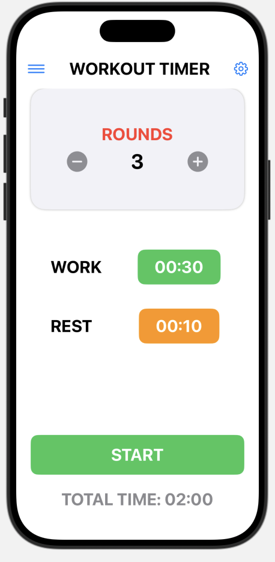
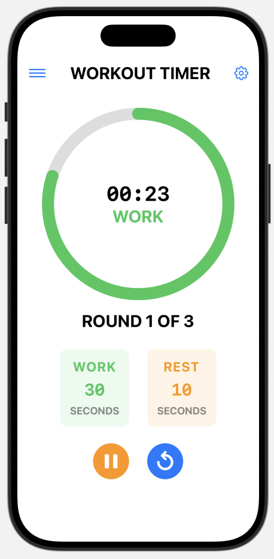
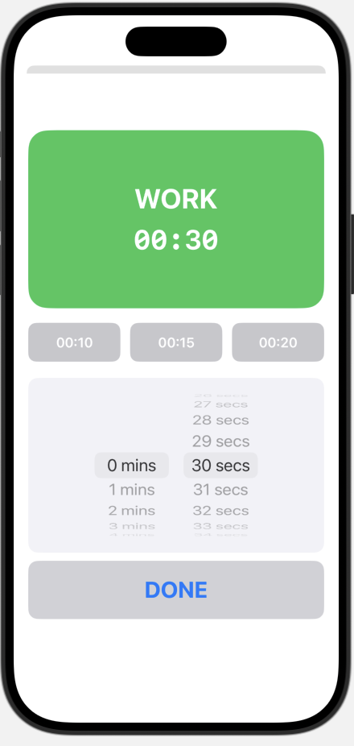
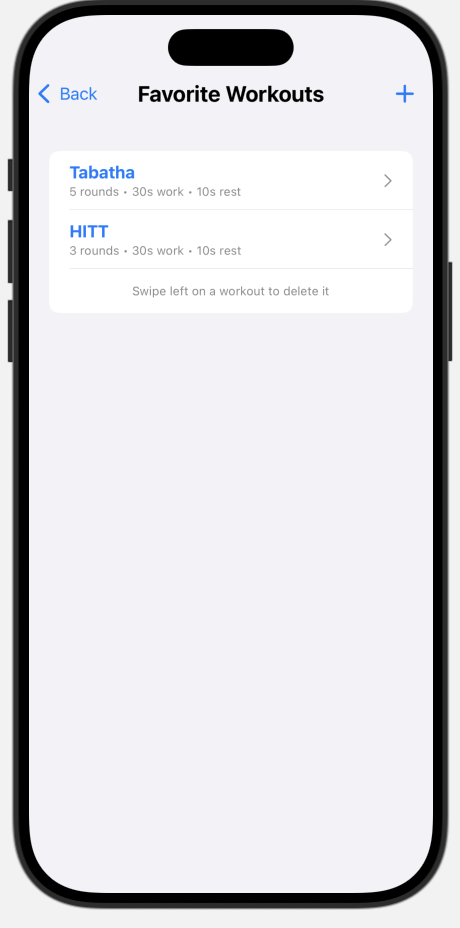
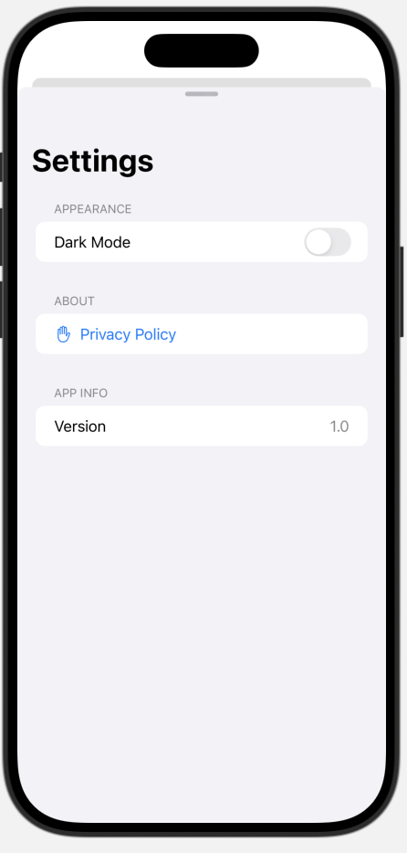

# WorkoutTimer

A clean, intuitive iOS app for interval training workouts with customizable work and rest periods. Features preparation countdown, screen wake prevention, enhanced audio cues, and seamless music integration.


## 🆕 Recent Updates

**✅ All Major Features Complete!** The WorkoutTimer is now production-ready with these recent enhancements:

- **🚀 Preparation Timer** - Get ready with a 10-second countdown before workouts begin
- **📱 Never Sleeps** - Screen stays on during workouts so your timer never stops
- **🔊 Enhanced Audio** - "Final Round" announcements and 3-second countdown chimes  
- **📈 Extended Capacity** - Support up to 60 rounds for longer training sessions
- **🔧 Reliability Fixes** - Resolved SwiftUI picker bugs for consistent behavior

## Features

### 🏃‍♂️ **Interval Training**
- **Preparation phase** - 10-second configurable countdown before workout starts
- Customizable work and rest intervals (1-59 minutes each)
- Configurable number of rounds (1-60)
- Visual progress indicator with circular timer
- Automatic transitions between work and rest periods
- **Screen stays on during workouts** - prevents timer from stopping when phone would normally sleep

### 🎵 **Audio Integration**
- Sound notifications for interval changes (prep, work, rest, completion)
- **"Final Round" announcement** when starting the last round
- **3-second countdown chimes** during final seconds of work/rest intervals
- **Plays alongside your music** - won't interrupt your playlist
- Haptic feedback for enhanced workout experience

### ⭐ **Favorite Workouts**
- Save your commonly used workout configurations
- Quick access to your preferred routines
- Easy management with swipe-to-delete

### 🎨 **User Experience**
- Clean, modern SwiftUI interface
- Dark mode support
- Intuitive controls (play, pause, resume, reset)
- Real-time workout status display
- **Battery-conscious screen wake** - one-time notification about increased battery usage
- Color-coded phases (blue=prep, green=work, orange=rest)

### 🔒 **Privacy First**
- No data collection or external transmission
- All data stored locally on your device
- No third-party analytics or tracking

## Screenshots

### Home Page

*Main interface for setting up and starting workouts*

### Active Workout

*Timer display during an active workout session*

### Time Picker

*Custom time picker for setting work and rest intervals*

### Favorites

*Manage and access your saved workout configurations*

### Settings

*App settings including dark mode and privacy policy*

## Requirements

- iOS 16.0+
- Xcode 15.0+
- Swift 5.0+

## Installation

### For Users
Not yet available on the app store. Need to contact Kyle Pfister for TestFlight copy.

### For Developers
1. Clone the repository
   ```bash
   git clone https://github.com/kpfister44/WorkoutTimer.git
   ```
2. Open `WorkoutTimer.xcodeproj` in Xcode
3. Build and run on your device or simulator

## Usage

1. **Set up your workout:**
   - Choose number of rounds (1-60)
   - Set preparation time (5-30 seconds)
   - Set work time (1-59 minutes)
   - Set rest time (1-59 minutes)

2. **Start your workout:**
   - Tap "START" to begin (first-time users see battery usage notification)
   - **10-second preparation countdown** gives you time to get ready
   - The app will automatically cycle through work and rest periods
   - **Screen stays on** throughout the workout to prevent timer interruption
   - Use pause/resume as needed

3. **Save favorites:**
   - Configure your preferred workout settings
   - Tap the hamburger menu (☰) to access favorites
   - Save your current configuration for quick access

4. **Enhanced workout experience:**
   - Enjoy "Final Round" audio announcements
   - Get 3-second countdown chimes for better timing
   - One-time notification explains battery usage for screen wake feature

## Architecture

The app follows MVVM architecture with SwiftUI:

- **Models**: `WorkoutModel` manages workout state and timer logic
- **Views**: SwiftUI views for UI components
- **Managers**: Singleton classes for sound, haptics, and favorites
- **Data**: Local storage using UserDefaults

### Key Components

- `WorkoutModel`: Core timer and workout state management with screen wake prevention
- `SoundManager`: Audio playback with music-friendly settings and enhanced workout cues
- `HapticManager`: Tactile feedback for better user experience
- `FavoriteWorkoutsManager`: Local storage for saved workouts including prep time

## Contributing

Contributions are welcome! Please feel free to submit a Pull Request.

## License

This project is licensed under the MIT License - see the [LICENSE](LICENSE) file for details.

## Support

If you have any questions or need support, please:
- Open an issue on GitHub

---

**Built with ❤️ using SwiftUI**